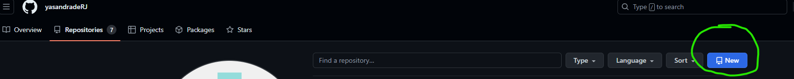
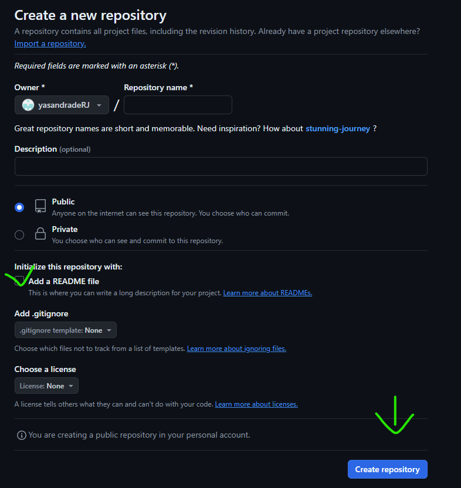
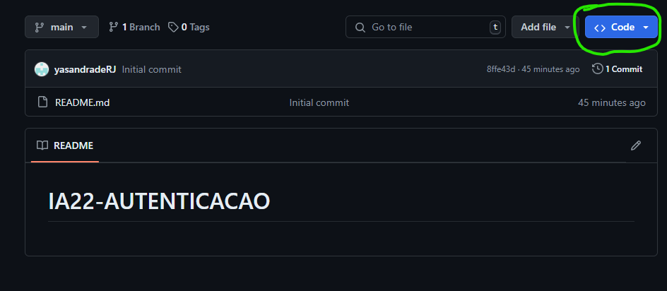
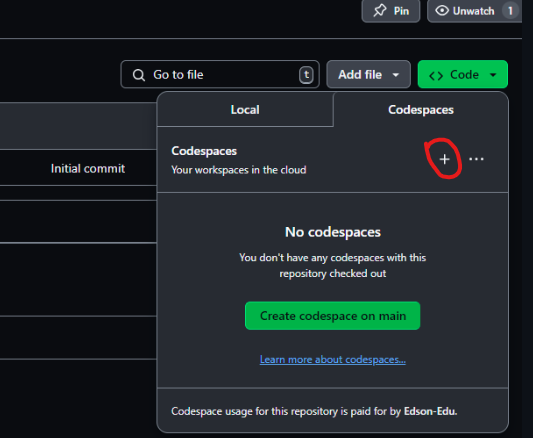

# Bem vindo!
To aqui pra te ajudar na hora da prova, então bora!

# Comece criando o repositório
Aperte no botão do canto esquerdo superior **"NEW"**

Em seguida, nomeie o repositório com **"IA24-AUTENTICAÇÃO"**
Lembre de **deixar ele público**, **adicionar o README**, e depois é só criar!

Depois que ele for criado, aperte em "CODE" e depois no "+" (maisinho) no canto superior.

**>>>>"Maisinho"**

Se der tudo certo, vai abrir no projeto!!

# Agora vamos ler o que voce precisa aprender!
# **Autenticação de usuários*

***Autenticação VS Autorização***

"Autenticação" é 

Já "Autorização" é 

# Autenticação com Token (JWT)

# Projeto (Objeto de Estudos)

